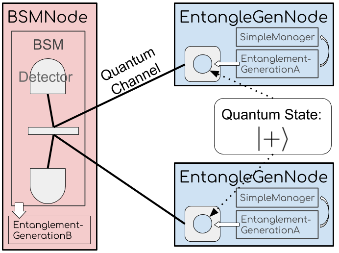
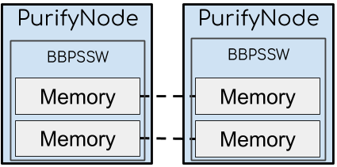
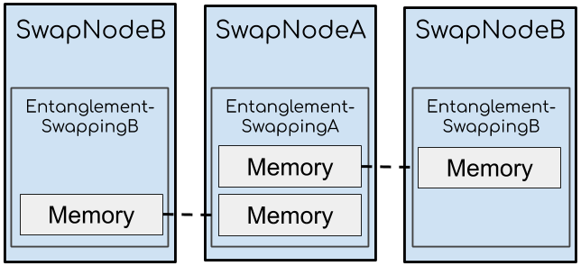

# Chapter 3: Entanglement Management

In previous chapters, we introduced the usage of hardware models. 
In this chapter, we will use protocols in the entanglement management module to control these hardware devices and change the entanglement state of quantum memories.
We will also use a simple manager protocol to control the entanglement generation protocols.
We will show

* how to use `EntanglementGenerationA` (Barret-Kok generation protocol) to entangle memories on different nodes
* how to use `BBPSSW` (BBPSSW purification protocol) to improve the fidelity of entanglement
* how to use `EntanglementSwappingA` and `EntanglementSwappingB` (swapping protocol) to extend the distance of entanglement


## Example: Use `EntanglementGenerationA` and `BSMNode` to generate entanglement 



The above figure shows the network topology used in this example. 
The network includes three nodes: one `BSMNode` node and two `EntangleGenNode` nodes. 
The `BSMNode` node comes from SeQUeNCe. 
We will build the custom node `EntangleGenNode` that inherits the `Node` class from SeQUeNCe.
Two quantum channels connect the `BSMNode` with the two `EntangleGenNode`. 
Classical channels and nodes create a complete classical graph, which is not shown in the figure. 

`BSMNode` includes:

* **Hardware**: two detectors in a bell state measurement device (BSM) to record the arrival time of photons.
* **Software**: the `EntanglementGenerationB` protocol to collect the arrival time of photons and notify the `EntanglementGenerationA` protocols on the other nodes.

`EntangleGenNode` includes:

* **Hardware**: one quantum memory in the |+&#10217; state, prepared to entangle with the remote memory on the other node.
* **Software**: the `EntanglementGenerationA` protocol to excite the controlled memory and determine the quantum state via messages from `EntanglementGenerationB`; 
a `SimpleManager` which uses the `update` function to get the state of the memory after the procedures in `EntanglementGenerationA`.

### Step 1: Customize Node 

We can import `BSMNode` from SeQUeNCe package and thus only need to define the `EntangleGenNode` class.
We also define our `SimpleManager`, which will create entanglement protocol instances and monitor their success.
The code for the `EntangleGenNode` and `SimpleManager` classes is shown below:

```python
from sequence.topology.node import Node
from sequence.components.memory import Memory
from sequence.entanglement_management.generation import EntanglementGenerationA


class SimpleManager:
    def __init__(self, own, memo_name):
        self.own = own
        self.memo_name = memo_name
        self.raw_counter = 0
        self.ent_counter = 0

    def update(self, protocol, memory, state):
        if state == 'RAW':
            self.raw_counter += 1
            memory.reset()
        else:
            self.ent_counter += 1

    def create_protocol(self, middle: str, other: str):
        self.own.protocols = [EntanglementGenerationA(self.own, '%s.eg' % self.own.name, middle, other,
                                                      self.own.components[self.memo_name])]


class EntangleGenNode(Node):
    def __init__(self, name: str, tl: Timeline):
        super().__init__(name, tl)

        memo_name = '%s.memo' % name
        memory = Memory(memo_name, tl, 0.9, 2000, 1, -1, 500)
        memory.owner = self
        memory.add_receiver(self)
        self.add_component(memory)

        self.resource_manager = SimpleManager(self, memo_name)

    def init(self):
        memory = self.get_components_by_type("Memory")[0]
        memory.reset()

    def receive_message(self, src: str, msg: "Message") -> None:
        self.protocols[0].received_message(src, msg)

    def get(self, photon, **kwargs):
        self.send_qubit(kwargs['dst'], photon)
```

In this customized `Node` class, we overwrite the `init`, `receive_message`, and `get` methods.
The `init` method will be used to reset the local memory at the beginning of the simulation.
The `get` method directs received photons from the memory to the attached quantum channel, as discussed in the previous tutorial.
Finally, for the `receive_message` method, the node will receive a classical message `msg` from the source node `src`. 

We also add a function `create_protocol(self, middle: str, other: str)` to the manager to create the local instance of the generation protocol.
The `middle` and `other` parameters declare the name of the `BSMNode` and `EntangleGenNode`, respectively, used for generating entanglement.

The constructor function of `EntanglementGenerationA` needs five arguments: 

1. the node that holds the protocol instance
2. the identity (name) of the protocol instance
3. the name of the `BSMNode` involved in entanglement generation
4. the name of the remote `EntangleGenNode` involved in entanglement generation
5. the memory used for generating entanglement

#### Q&A

Q: Why is the `SimpleManager` necessary?

A: We have embedded code that calls the `update` function of a `resource_manager` into our current implementations of entanglement protocols.
We also need a protocol to track which hardware components of the local node should be used.

Q: Why is the `EntanglementGenerationA` object placed in the list `EntangleGenNode.protocols`?

A: The implementation of `EntanglementGenerationA` assumes it has been placed in the `Node.protocols` list when it starts.


### Step 2: Create Network

As introduced in the previous chapter, we create nodes and channels to define the network.
To avoid unnecessary errors, we will set the efficiency of our detectors to 1. 

```python
from sequence.kernel.timeline import Timeline
from sequence.topology.node import BSMNode
from sequence.components.optical_channel import QuantumChannel, ClassicalChannel


tl = Timeline()

node1 = EntangleGenNode('node1', tl)
node2 = EntangleGenNode('node2', tl)
bsm_node = BSMNode('bsm_node', tl, ['node1', 'node2'])
node1.set_seed(0)
node2.set_seed(1)
bsm_node.set_seed(2)

bsm = bsm_node.get_components_by_type("SingleAtomBSM")[0]
bsm.update_detectors_params('efficiency', 1)

qc1 = QuantumChannel('qc1', tl, attenuation=0, distance=1000)
qc2 = QuantumChannel('qc2', tl, attenuation=0, distance=1000)
qc1.set_ends(node1, bsm_node.name)
qc2.set_ends(node2, bsm_node.name)

nodes = [node1, node2, bsm_node]

for i in range(3):
    for j in range(3):
        cc= ClassicalChannel('cc_%s_%s'%(nodes[i].name, nodes[j].name), tl, 1000, 1e8)
        cc.set_ends(nodes[i], nodes[j].name)
```

### Step 3: Configure and Start the `EntanglementGenerationA` Protocol

First, we will use `create_protocol` to create the instance of the protocol on the node. 
Before we start the protocol, we need to pair the protocols on the two nodes.
The function `pair_protocol` defined here uses two `EntangleGenNode` as the input and will pair all necessary protocols.
The protocols in `EntangleGenNode.protocols` are paired with the `set_others` method. 

Now, the protocols are ready to start generating entanglement and we can start our experiment. 

```python
from sequence.entanglement_management.entanglement_protocol import EntanglementProtocol


def pair_protocol(node1: Node, node2: Node):
    p1 = node1.protocols[0]
    p2 = node2.protocols[0]
    node1_memo_name = node1.get_components_by_type("Memory")[0].name
    node2_memo_name = node2.get_components_by_type("Memory")[0].name
    p1.set_others(p2.name, node2.name, [node2_memo_name])
    p2.set_others(p1.name, node1.name, [node1_memo_name])


node1.resource_manager.create_protocol('bsm_node', 'node2')
node2.resource_manager.create_protocol('bsm_node', 'node1')
pair_protocol(node1, node2)

memory = node1.get_components_by_type("Memory")[0]

print('before', memory.entangled_memory, memory.fidelity)
# "before node1.memo {'node_id': None, 'memo_id': None} 0"

tl.init()
node1.protocols[0].start()
node2.protocols[0].start()
tl.run()

print('after', memory.entangled_memory, memory.fidelity)
# (if the generation fails) "after node1.memo {'node_id': None, 'memo_id': None} 0"
# (if the generation succeeds) "after node1.memo {'node_id': 'node2', 'memo_id': 'node2.memo'} 0.9"
```

The `start` method starts the protocol. The `run` mehtod starts the simulation.
Note that the `start` method must be called after the timeline `init` method.
After the simulation, we can observe two possible states of memory based on the result of entanglement generation.
If the protocol generates entanglement successfully, the `Memory.entangled_memory` will present information about the entangled memory.
The fidelity of entanglements equal `0.9`, as set in the constructor function of `Memory`.
If the protocol fails, the fidelity of entanglement is `0`.


### Step 4: Try to Generate Entanglement Multiple Times

The mechanism of the Barrett-Kok generation protocol can achieve at most 50% success rate. 
We can, however, set the protocol to try multiple times and observe the success rate of protocol.
We will use the `Memory.reset()` method to reset the state of quantum memories before restarting protocols.

```python
for i in range(1000):
    tl.time = tl.now() + 1e11
    node1.resource_manager.create_protocol('bsm_node', 'node2')
    node2.resource_manager.create_protocol('bsm_node', 'node1')
    pair_protocol(node1, node2)

    tl.init()
    node1.protocols[0].start()
    node2.protocols[0].start()
    tl.run()

print("node1 entangled memories : available memories")
print(node1.resource_manager.ent_counter, ':', node1.resource_manager.raw_counter)
# (around 500:500; the exact number depends on the seed of numpy.random)
```


## Example: Use `BBPSSW` to improve the fidelity of entanglement



The above figure shows the network topology of this example. 
The network is composed of two `PurifyNode` nodes and one `ClassicalChannel`.
Two pairs of entangled memories are located at two nodes. 
The `BBPSSW` purification protocol will consume one entanglement to improve the fidelity of the other entanglement.


### Step 1: Customized Node

The custom `PurifyNode` class will inherit the `Node` class from SeQUeNCe. 
Similar to `EntangleGenNode`, we need to define a `SimpleManager` and rewrite the `receive_message` method.
The `kept_memo` is the memory whose fidelity will be improved by the purification protocol.
If the protocol purifies the `kept_memo` successfully, we will keep the `kept_memo`.
Otherwise, we will discard it.
The `meas_memo` is the consumed memory. 
We will always discard the `meas_memo` after the completion of the purification protocol.
We will also rewrite the code for the manager class to reflect our usage of two memories and the new purification protocol.


```python
from sequence.entanglement_management.purification import BBPSSW


class SimpleManager:
    def __init__(self, own, kept_memo_name, meas_memo_name):
        self.own = own
        self.kept_memo_name = kept_memo_name
        self.meas_memo_name = meas_memo_name
        self.raw_counter = 0
        self.ent_counter = 0

    def update(self, protocol, memory, state):
        if state == 'RAW':
            self.raw_counter += 1
            memory.reset()
        else:
            self.ent_counter += 1

    def create_protocol(self):
        kept_memo = self.own.components[self.kept_memo_name]
        meas_memo = self.own.components[self.meas_memo_name]
        self.own.protocols = [BBPSSW(self.own, 'purification_protocol', kept_memo, meas_memo)]


class PurifyNode(Node):
    def __init__(self, name: str, tl: Timeline):
        super().__init__(name, tl)
        kept_memo_name = '%s.kept_memo' % name
        meas_memo_name = '%s.meas_memo' % name
        kept_memo = Memory('%s.kept_memo' % name, tl, 0.9, 2000, 1, -1, 500)
        meas_memo = Memory('%s.meas_memo' % name, tl, 0.9, 2000, 1, -1, 500)
        self.add_component(kept_memo)
        self.add_component(meas_memo)

        self.resource_manager = SimpleManager(self, kept_memo_name, meas_memo_name)

    def receive_message(self, src: str, msg: "Message") -> None:
        self.protocols[0].received_message(src, msg)
```

The constructor function of BBPSSW requires four arguments:

1. The node that holds the protocol instance
2. The identity of the protocol instance
3. The memory used as the `kept_memo`
4. the memory used as the `meas_memo`

### Step 2: Create Network

We can now use the code below to create the simulated network. 

```python
tl = Timeline()

node1 = PurifyNode('node1', tl)
node2 = PurifyNode('node2', tl)
node1.set_seed(0)
node2.set_seed(1)

cc0 = ClassicalChannel('cc0', tl, 1000, 1e9)
cc1 = ClassicalChannel('cc1', tl, 1000, 1e9)
cc0.set_ends(node1, node2.name)
cc1.set_ends(node2, node1.name)
```

### Step 3: Manually Set Entanglement States 

To avoid unnecessary modules and operations, we will manually modify the memories to create an entangled state.
First, we use the `Memory.reset()` to reset the state of memory.
Then, we assign the identity of the node and memory to which we are entangled in `Memory.entangled_memory` (implemented as a dictionary `{'node_id': str, 'memo_id': str}`).
Finally, we set the fidelity of entanglement.

```python
def entangle_memory(memo1: Memory, memo2: Memory, fidelity: float):
    memo1.reset()
    memo2.reset()

    memo1.entangled_memory['node_id'] = memo2.owner.name
    memo1.entangled_memory['memo_id'] = memo2.name
    memo2.entangled_memory['node_id'] = memo1.owner.name
    memo2.entangled_memory['memo_id'] = memo1.name

    memo1.fidelity = memo2.fidelity = fidelity


kept_memo_1 = node1.components[node1.resource_manager.kept_memo_name]
kept_memo_2 = node2.components[node2.resource_manager.kept_memo_name]
meas_memo_1 = node1.components[node1.resource_manager.meas_memo_name]
meas_memo_2 = node2.components[node2.resource_manager.meas_memo_name]

entangle_memory(kept_memo_1, kept_memo_2, 0.9)
entangle_memory(meas_memo_1, meas_memo_2, 0.9)
```

### Step 4: Configure and Start BBPSSW Protocol

Similar to the previous example, we create, pair, and start the protocols.

```python
def pair_protocol(node1: Node, node2: Node):
    p1 = node1.protocols[0]
    p2 = node2.protocols[0]
    kept_memo_1_name = node1.resource_manager.kept_memo_name
    meas_memo_1_name = node1.resource_manager.meas_memo_name
    kept_memo_2_name = node2.resource_manager.kept_memo_name
    meas_memo_2_name = node2.resource_manager.meas_memo_name
    p1.set_others(p2.name, node2.name, [kept_memo_2_name, meas_memo_2_name])
    p2.set_others(p1.name, node1.name, [kept_memo_1_name, meas_memo_1_name])


node1.resource_manager.create_protocol()
node2.resource_manager.create_protocol()

pair_protocol(node1, node2)

tl.init()
node1.protocols[0].start()
node2.protocols[0].start()
tl.run()

print(kept_memo_1.name, kept_memo_1.entangled_memory, kept_memo_1.fidelity)
# 'node1.kept_memo {'node_id': 'node2', 'memo_id': 'node2.kept_memo'} 0.9263959390862945'
# or 'node1.kept_memo {'node_id': 'node2', 'memo_id': 'node2.kept_memo'} 0.9'

print(meas_memo_1.name, meas_memo_1.entangled_memory, meas_memo_1.fidelity)
# 'node1.meas_memo {'node_id': 'node2', 'memo_id': node2.meas_memo'} 0.9'
```

After the simulation, the first print statement produces one of two possible outputs. 
The first output (the first comment) shows a successful purification operation.
The second output (the second comment) shows the failure of purification.
Note that the entanglement fields and fidelity will be reset by the resource manager, discussed in the next chapter.
The success rate of purificaiton depends on the fidelity of entanglement.
Entanglements with higher fidelities have a higher success rate.

**Note**: The BBPSSW protocol assumes the fidelity of the two entangled pairs are the same.

**Note**: You can inherit the BBPSSW class and overwrite `BBPSSW.success_probability(F: float)` 
and `BBPSSW.improved_fidelity(F: float)` to customize the success probability and fidelity improvement of the purification protocol. 

### Step 5: Try to Purify Entanglement Multiple Times

We can run the purification protocol multiple times to observe the state of memory with different purification results.

```python
tl.init()
for i in range(10):
    entangle_memory(kept_memo_1, kept_memo_2, 0.9)
    entangle_memory(meas_memo_1, meas_memo_2, 0.9)

    node1.resource_manager.create_protocol()
    node2.resource_manager.create_protocol()

    pair_protocol(node1, node2)

    node1.protocols[0].start()
    node2.protocols[0].start()
    tl.run()

    print(kept_memo_1.name, kept_memo_1.entangled_memory, kept_memo_1.fidelity)
    print(meas_memo_1.name, meas_memo_1.entangled_memory, meas_memo_1.fidelity)
```

## Example: Use `EntanglementSwappingA` and `EntanglementSwappingB` to Extend Entanglement



The above figure shows the network topology of this example. 
The network consists of two `SwapNodeB` and one `SwapNodeA` connected by classical channels.

The `SwapNodeB` node has:

* **Hardware**: one quantum memory entangled with one memory on `SwapNodeA`
* **Software**: `EntanglementSwappingB` swapping protocol

The `SwapNodeA` node has:

* **Hardware**: two entangled memories
* **Software**: `EntanglementSwappingA` swapping protocol

The swapping protocols on the three nodes use these two pairs of entangled memories to generate the entanglement between two `SwapNodeB` nodes.
After the swapping protocol, the two memories on `SwapNodeA` are no longer entangled with the memories on each `SwapNodeB`.

### Step 1: Customized Node

The code below shows the implementation of `SwapNodeA`.
The `left_memo` is the memory entangled with the memory on the left `SwapNodeB`.
The `right_memo` is the memory entangled with the memory on the right `SwapNodeB`.

```python
class SwapNodeA(Node):
    def __init__(self, name: str, tl: Timeline):
        super().__init__(name, tl)
        left_memo_name = '%s.left_memo' % name
        right_memo_name = '%s.right_memo' % name
        left_memo = Memory(left_memo_name, tl, 0.9, 2000, 1, -1, 500)
        right_memo = Memory(right_memo_name, tl, 0.9, 2000, 1, -1, 500)
        self.add_component(left_memo)
        self.add_component(right_memo)

        self.resource_manager = SimpleManager(self, [left_memo_name, right_memo_name])

    def receive_message(self, src: str, msg: "Message") -> None:
        self.protocols[0].received_message(src, msg)
```

The code for `SwapNodeB` is identical to `SwapNodeA` but with only one memory:

```python
class SwapNodeB(Node):
    def __init__(self, name: str, tl: Timeline):
        super().__init__(name, tl)
        memo_name = '%s.memo' % name
        memo = Memory(memo_name, tl, 0.9, 2000, 1, -1, 500)
        self.add_component(memo)

        self.resource_manager = SimpleManager(self, [memo_name])

    def receive_message(self, src: str, msg: "Message") -> None:
        self.protocols[0].received_message(src, msg)
```

We reuse the `SimpleManager` defined in the previous example to create the `SwapNodeA` and `SwapNodeB` protocols.
We will thus add a field for storing multiple memory names and generate swapping protocols.
The `EntanglementSwappingA` constructor requires six arguments:

1. The node that holds the protocol instance
2. The identity of protocol instance
3. The first memory used for the swapping operation
4. The second memory used for the swapping operation
5. The success rate of swapping
6. The degradation rate of swapping

While the constructor for `EntanglementSwappingA` only requires three arguments:

1. The node that holds the protocol instance
2. The identity of protocol instance
3. The memory having its entanglement swapped

We will set up the manager so that it automatically creates the right type of swapping potocol depending on the local node.

**Note**: the fidelity of entanglement after swapping is `f1 * f2 * fd`, where `f1`, `f2` denote the fidelity of the two entangled pairs and `fd` denotes the degradation rate.

```python
from sequence.entanglement_management.swapping import EntanglementSwappingA, EntanglementSwappingB

class SimpleManager:
    def __init__(self, own, memo_names):
        self.own = own
        self.memo_names = memo_names
        self.raw_counter = 0
        self.ent_counter = 0

    def update(self, protocol, memory, state):
        if state == 'RAW':
            self.raw_counter += 1
            memory.reset()
        else:
            self.ent_counter += 1

    def create_protocol(self):
        if type(self.own) is SwapNodeA:
            left_memo = self.own.components[self.memo_names[0]]
            right_memo = self.own.components[self.memo_names[1]]
            self.own.protocols = [EntanglementSwappingA(self.own, 'ESA', left_memo, right_memo, 1, 0.99)]
        else:
            memo = self.own.components[self.memo_names[0]]
            self.own.protocols = [EntanglementSwappingB(self.own, '%s.ESB' % self.own.name, memo)]
```

### Step 2: Create Network

We create the three nodes and connect them with classical channels. 

```python
tl = Timeline()

left_node = SwapNodeB('left', tl)
right_node = SwapNodeB('right', tl)
mid_node = SwapNodeA('mid', tl)
left_node.set_seed(0)
right_node.set_seed(1)
mid_node.set_seed(2)

nodes = [left_node, right_node, mid_node]

for i in range(3):
    for j in range(3):
        cc = ClassicalChannel('cc_%s_%s' % (nodes[i].name, nodes[j].name), tl, 1000, 1e9)
        cc.set_ends(nodes[i], nodes[j].name)
```

### Step 3: Manually Set Entanglement State and Start Protocol

We will reuse the code for `entangle_memory` from the previous examples to configure the states of hardware and software.
The `pair_protocol` function is slightly more complicated, as there are more nodes to deal with.
Because we set the success probability to 1, we can guaruntee a successful result after running the simulation.
The fidelity of entanglement after swapping will be `0.9*0.9*0.99=0.8019`.

```python
def pair_protocol(node1, node2, node_mid):
    p1 = node1.protocols[0]
    p2 = node2.protocols[0]
    pmid = node_mid.protocols[0]
    p1.set_others(pmid.name, node_mid.name,
                  [node_mid.resource_manager.memo_names[0], node_mid.resource_manager.memo_names[1]])
    p2.set_others(pmid.name, node_mid.name,
                  [node_mid.resource_manager.memo_names[0], node_mid.resource_manager.memo_names[1]])
    pmid.set_others(p1.name, node1.name, [node1.resource_manager.memo_names[0]])
    pmid.set_others(p2.name, node2.name, [node2.resource_manager.memo_names[0]])

left_memo = left_node.components[left_node.resource_manager.memo_names[0]]
right_memo = right_node.components[right_node.resource_manager.memo_names[0]]
mid_left_memo = mid_node.components[mid_node.resource_manager.memo_names[0]]
mid_right_memo = mid_node.components[mid_node.resource_manager.memo_names[1]]
entangle_memory(left_memo, mid_left_memo, 0.9)
entangle_memory(right_memo, mid_right_memo, 0.9)

for node in nodes:
    node.resource_manager.create_protocol()

pair_protocol(left_node, right_node, mid_node)

tl.init()
for node in nodes:
    node.protocols[0].start()
tl.run()

print(left_memo.entangled_memory)
# {'node_id': 'right', 'memo_id': 'right.memo'}

print(mid_left_memo.entangled_memory)
# {'node_id': None, 'memo_id': None}

print(mid_right_memo.entangled_memory)
# {'node_id': None, 'memo_id': None}

print(right_memo.entangled_memory)
# {'node_id': 'left', 'memo_id': 'left.memo'}

print(left_memo.fidelity)
# 0.8019000000000001
```
